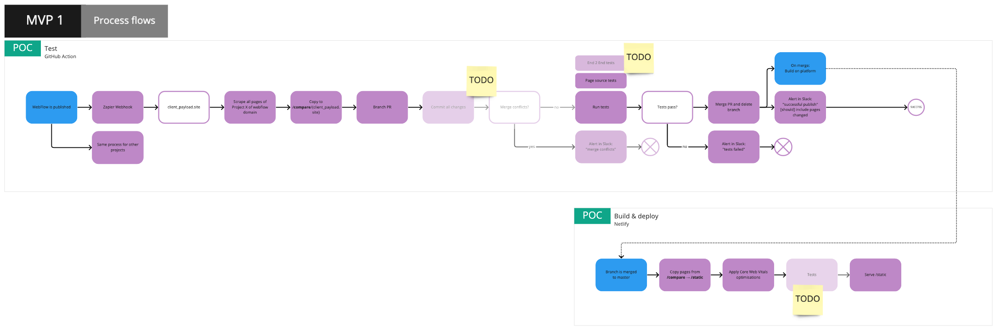

# Wombat

Webflow Combat

## Purpose

Scrapes pages from Webflow whenever a project is published.

- Run tests on the source of scraped pages
- Transform source code with Core Web Vitals optimisations
- Serve all pages on a different platform so any Webflow publish will only go live if it passes all tests and transformations

## Why

Webflow has signficant issues that reduce the safety of any given publish action.

**Webflow problems**
Ticks are where this project solves the issue:

- [x] Changes are very obfuscated and not clear what is being done (or undone if reverting)
- [x] Changes made while developing can accidentally be left in the code and published
- [x] Bad page construction for core web vitals that cannot be changed as they are editable in the Webflow designer
- [x] Single CSS file for entire project (all pages share one large file)
- [x] Unable to see what changes will go live without manually reviewing an entire project _before_ clicking publish
- [x] Clear list of changes each publish
- [x] Reverting changes
- [ ] When publishing all project pages will go live and it cannot be "locked" to a given page or set of changes
- [ ] CSS edited on one side of the site can affect the rest of the site

## Project architecture

### Process flow



#### Setup a Webflow project

Add a webhook to a Webflow project on `publish`. Zapier is one option, there are many others.

#### When a Webflow project is published

- WebFlow is published, fires the Webhook
  - `domains` are extracted and first domain is included in `client_payload.site` for GitHub workflow. Any domain can be used, all point to the same place
  - `POST` to [Wombat GitHub actions](https://api.github.com/repos/offerzen/wombat/dispatches) as `publish_webflow`
- Fires the `.github/workflows/publish.yml` workflow
  - Webflow project specified in `client_payload.site` is scraped
  - All files are placed in `/compare`
    - Files are placed in a root folder based on name from `client_payload.site`
    - Folders are created based on directory path and pages are added as `index.html` files
  - PR is created so raw (without transformations) Webflow files can be compared to the last publish
  - Source code tests (`yarn test`) are run against `/compare` files. This uses Jest (all added to `/tests`)
  - Any successes or failures for this workflow will be reported to Slack _#gp-webflow-platform_

#### Build and deploy

To ensure only tested files are deployed, all files are taken from `/compare` and not rescraped.

- Delete everything in `/static` to ensure we don't serve old content
- Copy everything `/compare` to `/static`.
- `/compare` content is always added to git but `/static` is not, so that there are no extra
- Run optimsation transformations (`/core-web-vitals/index.mjs`) on html source and recopy files to `/static`.
- Possibility: trigger end-to-end tests in staging (outside of project scope)
- Serve

### File architecture

Core components are marked by `[component]`.

```bash
├── babel.config.js                #
│
├── [build]                        `Component: Builder`
│   │                               Building the output for deployment. This will be run as a final step before deployment.
│   │                               Files are modified and copied from `/compare` to `/static`.
│   ├── assets                     # Operate on any assets
│   │   └── rewriteAssetPaths.mjs  # All paths to Webflow's CDN are rewritten to use our CDN
│   ├── coreWebVitals              # Optimisation transformations plugins
│   │   ├── css                    # Optimisation plugins for css
│   │   │   └── uncss.mjs          # Plugin: Makes CSS per-page instead of per-project and strips out unnecessary rules
│   │   ├── html                   # Optimisation plugins  for html
│   │   │   └── typekit.mjs        # Makes Typekit async
│   │   └── index.mjs              #
│   └── index.mjs                  # Run by `yarn build`. Copies from /compare to /static and runs all plugins
│
├── compare                        # Scraped files from Webflow without transformations
│   └── ...
│
├── docs                           # Images for this readme
│   └── ...
│
├── helpers                        # Shared tools
│   └── utils.mjs                  # Read files from directory, pipe
│
├── jest.config.js                 # For jest source code tests
├── scrape-all.sh                  # Scrapes all files for each Webflow project to populate /compare if needed
│
├── [scraper]                      `Component: Scraper`
│   │                               Get all the pages and assets from Webflow. Downloads files to `/compare`.
│   ├── assetScraper.mjs           # Handle scraping and downloading assets e.g. images, css, svg files
│   ├── config.mjs                 # Global vars for current site
│   ├── htmlScraper.mjs            # Handle scraping HTML
│   ├── scrape.mjs                 # Scrape Webflow based on sitemap
│   └── sitemap.mjs                # Get sitemap from Webflow as targets
│
├── static                         # Scraped files from Webflow with optimisations for serving
│   └── ...
│
└── [tests]                        `Component: Tester`
    │                               Tests to run on scraped content
    │                               Use Jest, and see the example `test.template.js` to learn more.
    ├── ngrok.test.js              # Checks for presence of ngrok
    ├── setup.mjs                  # Allows tests to query source with `global.html(...)`
    └── test.template.js           # Example test
```

_To regenerate above, install `tree` e.g. `brew install tree` and run `yarn doc-tree` and cleanup output._

## Local development

Add a .env file with the following:

```bash
SITE=    # e.g https://offerzen.webflow.io/
CDN_URL= # e.g. https://offerzen.github.io/assets/
```

Setup the project:

```bash
$ yarn
```

Scrape just one project:

```bash
$ yarn scrape
```

Run tests on scraped files:

```bash
$ yarn test
```

Run build-step optimisations/transformations:

```bash
$ yarn build
```
